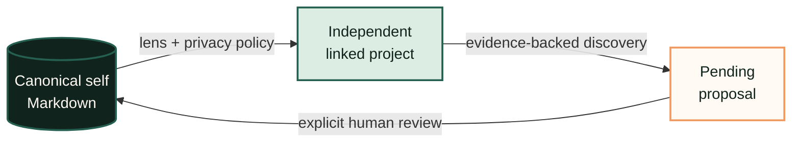
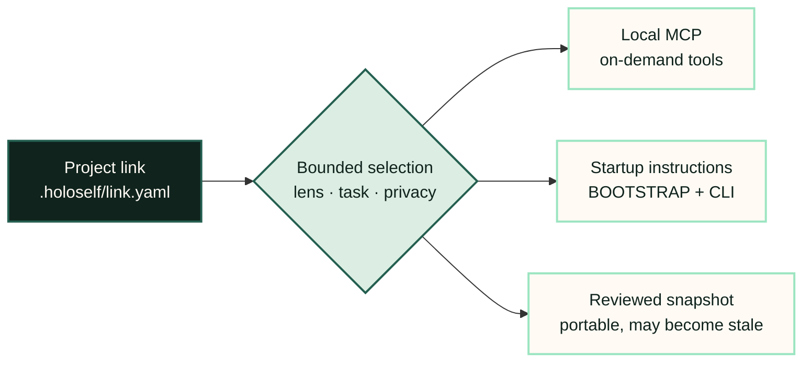

<p align="center">
  
</p>

<p align="center">
  <a href="https://github.com/smota/holoself/releases"></a>
  <a href="https://github.com/smota/holoself/stargazers"></a>
  <a href="docs/guides/local-mcp.md"></a>
  <a href="package.json"></a>
  <a href="LICENSE"></a>
</p>

<p align="center">
  
</p>

**Stop re-explaining yourself to every AI tool.**

Holoself keeps approved personal context in readable local files, links it to independent projects through task-specific lenses, and asks before project discoveries become durable knowledge.

Plain language: **your context, under your control, reusable across tools and projects.**

Technical description: **an open-source, local-first whole-person context protocol built on Markdown, project links, lenses, provenance, deterministic local indexing, and explicit proposal review.**

> Projects own their artifacts. Self owns approved reusable personal knowledge.

## Why Holoself

AI app memory is often opaque and tool-bound. Profile files are easy to duplicate and let drift. Central personal vaults tend to absorb project work that belongs elsewhere. Holoself separates these concerns:



- **One whole person, many lenses.** Built-in and optional private registry-backed lenses change explicit read scope and relevance—not identity or publication approval. Custom base lenses never inherit document access.
- **Independent projects.** Applications, research, posts, calendars, and execution notes stay with their projects.
- **Review before memory.** Projects propose; only explicit approval changes canonical self context.
- **Inspectability.** Markdown is source of truth. Generated packets and indexes are disposable.
- **Provenance.** Context and accepted claims identify their source files.
- **Local by default.** CLI performs no network requests and requires no hosted account.

## Product status

| Capability | Status |
|---|---|
| Private Markdown data root | Stable |
| Project metadata links and lenses | Available |
| Context packets and JSON adapters | Available |
| Proposal/review workflow | Available |
| Deterministic local index and federated search | Available |
| Local project-bound STDIO MCP | Available; preferred per platform after native verification |
| Overlap/conflict/stale reports | Available |
| Legacy packet export and filesystem junction | Supported compatibility path |
| SQLite/FTS acceleration | Planned, optional |
| Embedding/vector search | Planned, optional |
| Hosted sync or account | Not provided |
| npm registry package | Not published yet |

## Start here

Requirements: Node.js 20+ and a private location for personal context.

Choose the path that matches what you want to do:

| I want to… | Start with |
|---|---|
| Set up Holoself and see it working | [Quickstart](docs/start/quickstart.md) |
| Manage context visually | [Workbench guided tour](docs/workbench/index.md) |
| Give an AI project relevant context | [First linked project](docs/start/first-linked-project.md) |
| Solve a specific everyday task | [Common use cases](docs/guides/common-use-cases.md) |
| Integrate or assess the data model | [Architecture](docs/architecture.md#architecture-at-a-glance) |

```bash
git clone https://github.com/smota/holoself.git
cd holoself
node bin/holoself.mjs init --data-dir C:/private/my-self
node bin/holoself.mjs doctor --data-dir C:/private/my-self
node bin/holoself.mjs validate --data-dir C:/private/my-self
```

These commands use the source-checkout form because the npm registry package is not published yet. Throughout the documentation, `node bin/holoself.mjs` means “run this checkout directly,” while `holoself` means the same CLI through a package bin available on `PATH`. MCP clients must use the installed `holoself` form because they launch the command outside this shell. See [CLI invocation and reference](docs/reference/cli.md#invocation).

Install the declarative agent skill separately when useful:

```bash
npx skills add smota/holoself --skill holoself
```

The skill contains instructions, not personal data. The quickstart below works without installing it.

## Optional Workbench

Workbench is the easiest way to browse your context, understand linked projects, review proposed knowledge, and see what needs attention. It is local and optional; Markdown and the CLI remain the source of truth and control surface.

<p align="center">
  <a href="docs/workbench/index.md"></a>
</p>

<p align="center"><em>A local overview of spaces, knowledge health, proposals, and recent conversations.</em></p>

```bash
node bin/holoself.mjs web --root C:/private/my-self
```

It opens on `127.0.0.1` and requires no hosted account. Start with the [screen-by-screen Workbench tour](docs/workbench/index.md). Architecture, connector, and trust-boundary details remain in the [Workbench reference](docs/web-gui.md).

## Link an independent project

```bash
node bin/holoself.mjs link add \
  --project C:/work/my-project \
  --self C:/private/my-self \
  --lens career

node bin/holoself.mjs context \
  --project C:/work/my-project \
  --task "prepare interview" \
  --json
```

`link add` writes project-local metadata under `.holoself/`, detects agent platforms, generates `.holoself/BOOTSTRAP.md`, and injects bounded startup pointers into detected instruction files after confirmation. It does not copy canonical self files. See [Activated project links](docs/guides/activated-links.md).

For verified MCP-capable clients, preview and activate typed on-demand access after linking:

```bash
holoself mcp configure --project C:/work/my-project --dry-run
holoself mcp configure --project C:/work/my-project --yes
```

First confirm that `holoself --version` works in the environment used by the client. The client starts `holoself mcp` as a local STDIO subprocess for that project. It is not a service. The explicit link remains authority; BOOTSTRAP/skill/CLI remain the fallback. See [Local MCP integration](docs/guides/local-mcp.md).

### Three distinct delivery modes

Every mode begins with the same project link and stays within its lens and privacy policy. The difference is how bounded context reaches the consumer:



- **Metadata project link — recommended:** `link add|status|remove|setup|activate|deactivate|repair|doctor --project ...` creates `.holoself/link.yaml`, activates configured startup pointers, and maintains local index, proposal, and report directories.
- **Local MCP — preferred interaction where verified:** the agent client launches Holoself on demand and calls bounded typed tools; this still requires the metadata link and coexists with startup instructions.
- **Snapshot:** `export` or `context --snapshot` creates reviewed generated context for portable or sandboxed use. It is not live and can become stale.
- **Legacy live mount:** `link --target ...` creates a filesystem symlink/junction from project `.holoself` to complete data root. It remains compatibility-only.

Never substitute one mode for another without reviewing privacy exposure. Startup adapters configure instruction pointers; packet formatters only change output framing. Generated files do not prove an application discovered them. See [Runtime adapters](docs/guides/runtime-adapters.md). See [Link or export?](docs/guides/link-or-export.md).

## Common workflows

```bash
# Inspect the validated lens vocabulary and project context
node bin/holoself.mjs lens list --root C:/private/my-self
node bin/holoself.mjs context --project C:/work/my-project --lens career --format packet --adapter claude

# Produce non-mutating ownership/conflict recommendations
node bin/holoself.mjs analyze all --project C:/work/my-project

# Propose reusable knowledge, then review it
node bin/holoself.mjs propose --project C:/work/my-project --claim "..." --evidence "..." --source-file notes.md
node bin/holoself.mjs proposals show <id> --project C:/work/my-project
node bin/holoself.mjs proposals approve <id> --project C:/work/my-project --yes

# Build and query disposable local indexes
node bin/holoself.mjs index rebuild --project C:/work/my-project
node bin/holoself.mjs search "regulated AI" --project C:/work/my-project --federated
```

Approval prints target, evidence, affected files, and proposed diff before writing. Automation must pass `--yes` explicitly.

## Documentation

- [Documentation map](docs/README.md)
- [Whole-person context](docs/concepts/whole-person-context.md)
- [Ownership](docs/concepts/ownership.md)
- [Lenses and privacy](docs/concepts/lenses-and-privacy.md)
- [Proposal review](docs/concepts/proposal-review.md)
- [Context efficiency and receipts](docs/concepts/context-efficiency.md)
- [Knowledge lifecycle](docs/concepts/knowledge-lifecycle.md)
- [CLI reference](docs/reference/cli.md)
- [Local MCP integration](docs/guides/local-mcp.md)
- [Common use cases](docs/guides/common-use-cases.md)
- [MCP tools](docs/reference/mcp-tools.md)
- [Threat model](docs/trust/threat-model.md)
- [Status and roadmap](docs/contributing/status-and-roadmap.md)
- [Privacy policy](PRIVACY.md)
- [Workbench guided tour](docs/workbench/index.md)
- [Workbench architecture and trust boundary](docs/web-gui.md)

## Development

```bash
npm test
npm run audit:package
node bin/holoself.mjs --help
```

Public package paths contain code, schemas, templates, synthetic defaults, and documentation only. Private profile, context, topics, reference material, and local contribs must remain outside this repository.
