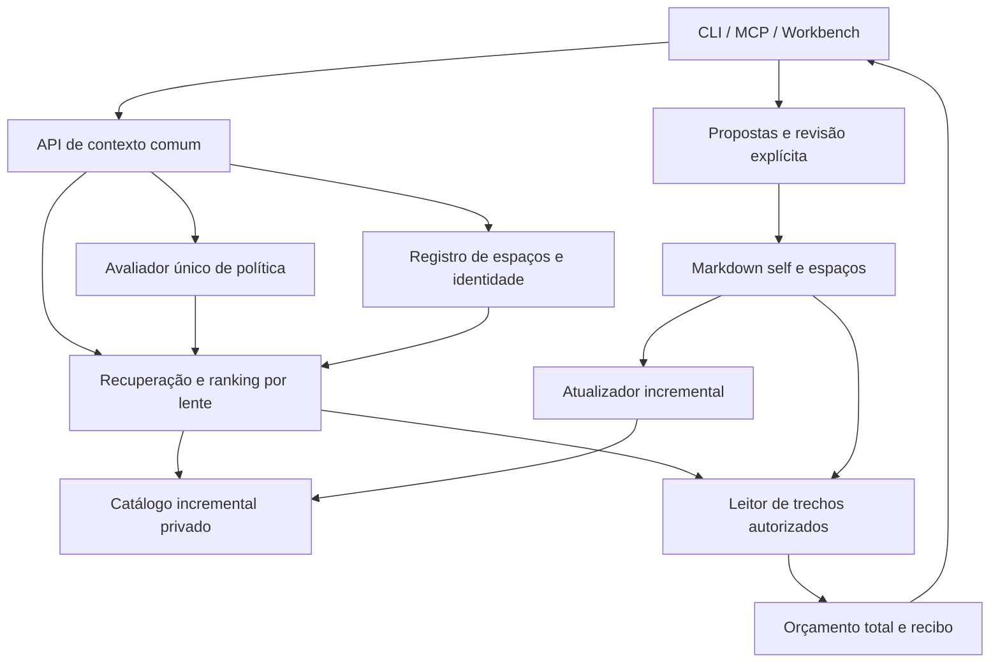
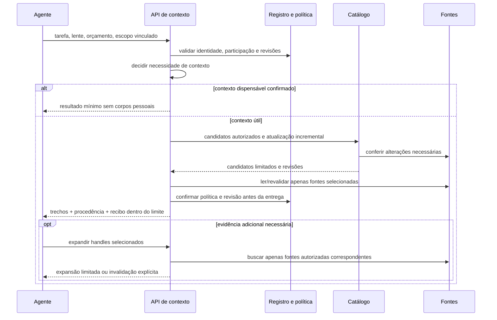

# Holoself: contexto eficiente e lentes integradas

| Campo | Valor |
|---|---|
| ID | HS-SPEC-001 |
| Versão | 0.1 |
| Estado | Proposta de especificação para revisão; implementação não iniciada |
| Data | 2026-09-19 |
| Baseline de código | `1217e7c5241fcd3bc9a8aa1a6e759f6e16c78a95`, pacote 0.8.0 |
| Origem | Análise local, reproduções sintéticas e revisão independente pelo Claude Code |
| Autoridade | Define o alvo proposto; não substitui as políticas vigentes enquanto não implementado e aprovado |
| Próxima transição | Instrução do usuário para planejamento de desenvolvimento autônomo |

## 0. Entrada para agentes

**Resultado desejado:** uma pessoa, vários espaços e lentes; contexto relevante recuperado com custo limitado, acesso interno previsível e barreiras explícitas para conteúdo restrito, publicação e alteração durável.

Este é o documento único da especificação. IDs são referências estáveis para planejamento, implementação e validação. As seções permitem leitura seletiva, sem duplicar requisitos em documentos auxiliares.

| Necessidade do agente | Ler |
|---|---|
| Entender objetivo e limites | 0–3 |
| Implementar política ou migração | 4–6, 8, 10 |
| Implementar catálogo, recuperação ou orçamento | 4–7, 10 |
| Integrar interfaces ou federação | 5–8, 10 |
| Validar um ciclo | Linha do ciclo em 8 + requisitos e testes referenciados |
| Coordenar trabalho futuro | 8–10; consultar componentes em 6 conforme a atribuição |

Todo agente implementador deve receber os invariantes da seção 5 e o escopo de sua atribuição. Esta especificação não autoriza execução, migração de dados pessoais, publicação, instalação, commits ou criação de agentes. A distribuição de trabalho, ferramentas, modelos, orçamento e sequência operacional pertencem ao planejamento posterior.

**Convenções:** `E-*` = evidência; `P-*` = problema; `J-*` = job; `R-*` = requisito; `A-*` = componente; `V-*` = teste de aceite; `C-*` = ciclo; `D-*` = decisão aberta. “Deve” indica comportamento exigido no alvo proposto, não comportamento disponível hoje.

## 1. Contexto, intenção e fronteiras

O usuário relata excesso de arquivos lidos antes de uma decisão e dificuldade em prever quando diretórios linkados são acessíveis. A intenção é usar esses diretórios como lentes e fontes da mesma pessoa, com compartilhamento interno fluido e barreiras proporcionais.

O produto atual preserva Markdown, procedência, propostas e filtros de privacidade. Entretanto, combina seleção temática com autorização por lente, consulta predominantemente self + projeto atual e executa varreduras antes de aplicar os mecanismos de economia.

**Incluído:** recuperação local, política de leitura, contratos CLI/MCP/Workbench, lentes, federação entre espaços registrados, observabilidade, instruções para agentes e migração compatível com aprovação explícita.

**Fora do escopo:** hospedar dados, sincronizar máquinas, trocar de linguagem, implantar um serviço central remoto, adotar embeddings obrigatórios, reorganizar automaticamente documentos pessoais ou automatizar publicação e aprovação de memória. Essas mudanças não são necessárias para resolver os problemas comprovados.

## 2. Taxonomia do contexto, problema e solução

### 2.1 Entidades de contexto

| Entidade | Definição | Autoridade e comportamento |
|---|---|---|
| Self | Conhecimento pessoal durável e aprovado | Markdown canônico; alterações pelo fluxo de revisão |
| Espaço | Diretório/projeto registrado com proprietário e política próprios | Mantém seus artefatos e identidade estável |
| Conjunto pessoal | Espaços explicitamente associados à mesma pessoa para consulta interna | Registro de participação e compartilhamento; não inferido de diretórios vizinhos |
| Fonte | Documento pertencente a um espaço | Identidade inclui espaço + caminho relativo; hash representa revisão |
| Trecho | Unidade recuperável de uma fonte | Preserva procedência e restrições de documento/campo/afirmação |
| Lente | Perspectiva de relevância, prioridades e forma de resposta | Opera dentro do acesso permitido; não concede acesso |
| Política | Regras de leitura, compartilhamento, sensibilidade e divulgação | Avaliação única, versionada e explicável |
| Método | Contribuição pública ou privada opcional | Elegibilidade antes da seleção; falha opcional não bloqueia fontes válidas |
| Catálogo | Projeção pesquisável de fontes, trechos, revisões e políticas | Derivado, privado e reconstruível; não substitui Markdown |
| Pacote de contexto | Resultado limitado para uma tarefa | Inclui trechos, procedência, restrições relevantes e recibo compacto |
| Proposta | Descoberta candidata a memória durável | Não equivale a fato aprovado nem modifica self antes de revisão |

Dimensões independentes: **proprietário** (self/espaço), **leitura** (compartilhada/local/restrita), **sensibilidade** (tratamento adicional), **divulgação** (internal-only/review-required/publish-approved), **ciclo de vida** (current/historical/superseded), **papel** (policy/evidence/content) e **relevância** (tarefa/lente). Seus valores finais e sua representação versionada serão fechados em D-01.

### 2.2 Problemas e classes de solução

| Problema | Classe | Efeito | Solução proposta |
|---|---|---|---|
| P-01 | Amplificação de leitura | Cache, manifesto e expansão ainda varrem corpos | Catálogo incremental e leitura direta de fontes |
| P-02 | Amplificação de resposta | Metadados escapam do orçamento | Orçamento total, paginação e recibos compactos |
| P-03 | Autoridade inconsistente | CLI aceita lente negada pelo MCP | Um avaliador de política compartilhado |
| P-04 | Acoplamento lente/acesso | Nova perspectiva exige reclassificar documentos | Separar perspectiva de autorização |
| P-05 | Composição inválida | Método opcional derruba consulta customizada | Filtrar elegibilidade antes da montagem |
| P-06 | Federação incompleta | Espaços da mesma pessoa não cooperam na busca | Registro explícito e recuperação entre espaços |
| P-07 | Custo cognitivo do agente | Agente interpreta localização e política em prosa | Entrada curta e resolução pelo produto |
| P-08 | Verificação insuficiente | Testes passam sem medir custo e paridade reais | Testes instrumentados e matriz de autorização |

## 3. Jobs-to-be-done em três níveis

| Nível 1: resultado | Nível 2: capacidade | Nível 3: job verificável |
|---|---|---|
| J-1 Decidir com continuidade pessoal | J-1.1 Recuperar o necessário | J-1.1.1 Dada uma tarefa, receber contexto curto com fontes pertinentes |
| J-1 | J-1.1 | J-1.1.2 Expandir uma evidência sem reler o conjunto inteiro |
| J-1 | J-1.2 Usar várias perspectivas | J-1.2.1 Mudar de lente preservando acesso ao conhecimento compartilhado |
| J-1 | J-1.2 | J-1.2.2 Combinar evidências de dois espaços sem copiar seus documentos |
| J-2 Confiar nos limites | J-2.1 Prever leitura | J-2.1.1 Obter a mesma decisão por CLI, MCP e Workbench para a mesma identidade e operação |
| J-2 | J-2.1 | J-2.1.2 Entender uma omissão sem expor conteúdo ou existência de fontes não autorizadas |
| J-2 | J-2.2 Controlar ações | J-2.2.1 Consultar internamente sem conceder publicação ou alteração de memória |
| J-2 | J-2.2 | J-2.2.2 Revogar compartilhamento e impedir que caches continuem servindo a fonte |
| J-3 Operar com baixo custo | J-3.1 Evitar trabalho repetido | J-3.1.1 Repetir uma consulta sem reabrir corpos inalterados |
| J-3 | J-3.1 | J-3.1.2 Resolver uma operação mecânica sem carregar contexto pessoal desnecessário |
| J-3 | J-3.2 Evoluir com segurança | J-3.2.1 Validar qualidade, custo e privacidade com fixtures reproduzíveis |
| J-3 | J-3.2 | J-3.2.2 Migrar políticas com comparação de acesso antes/depois e reversão documentada |

## 4. Evidência e fit-gap da solução atual

### 4.1 Baseline verificável

As medições abaixo foram feitas na análise que originou esta especificação, em diretórios temporários, com 100 documentos sintéticos adicionais aos padrões de `init`. Instrumentou-se `readFileSync` para contar leituras desses 100 documentos. Não são medições de produção, latência ou tokens reais de um modelo. O script exploratório não foi incorporado ao repositório; C-00 deve transformar a reprodução em fixture persistente.

| ID | Observação | Evidência local |
|---|---|---|
| E-01 | Consulta fria, repetida com cache hit, manifesto e expansão de uma fonte leram os 100 documentos em cada operação | `src/ecosystem.mjs`: `sourceRecords`, `contextData`; `src/context-selection.mjs`: `cacheKey`, `persistentSelection` |
| E-02 | Busca com índice recém-construído releu os 100 documentos | `src/ecosystem.mjs`: `indexInputHash`, `indexFreshness` |
| E-03 | Manifesto retornou 240.748 caracteres de JSON e `estimated_tokens: 0`; uma expansão retornou 4.484 caracteres | `src/context-selection.mjs`: `selectContextRecords`; contagem inclui saída serializada da CLI |
| E-04 | Link somente `general`: CLI aceitou `private`, MCP retornou `LENS_NOT_GRANTED` | `src/ecosystem.mjs`: `contextData`, `mcpContextData` |
| E-05 | Lente customizada `spiritual` falhou na validação final por métodos públicos `communication` e `quarterly-reflection` | `src/ecosystem.mjs`: `contribRecords`, `resolvedContextAssertions` |
| E-06 | `federated` deduplica resultados do índice self + projeto; não percorre outros projetos registrados | `src/ecosystem.mjs`: `holoselfMcpSearch` e ramo CLI `search`; inspeção estática |
| E-07 | `not-needed` não impede seleção: registro sintético retornou 7.989 caracteres | `src/context-selection.mjs`: `contextNeed`, `selectContextRecords` |
| E-08 | 35 testes de eficiência, lentes, privacidade e MCP passaram antes das correções propostas | `tests/efficiency.test.mjs`, `tests/lenses.test.mjs`, `tests/privacy-capabilities.test.mjs`, `tests/mcp.test.mjs` |

O Claude Code fez revisão independente somente do código do repositório e convergiu sobre E-01, E-06, complexidade das permissões e instruções. Também apontou ausência de poda no cache persistente. Sua recomendação de tornar sensibilidade apenas informativa não foi adotada: restrições sensíveis continuam efetivas no alvo.

**Precisão sobre cache:** `noCache: true` no MCP desativa o cache persistente dessa resolução, mas o fluxo ainda pode usar `cachedSelection` em memória. Nenhuma dessas modalidades evita as leituras prévias de `sourceRecords` no baseline.

### 4.2 Fit-gap

| Capacidade | Fit atual | Gap | Decisão proposta | Requisitos |
|---|---|---|---|---|
| Markdown e propriedade dos projetos | Adequado | Nenhum estrutural comprovado | Preservar | R-01 |
| Procedência e revisão de propostas | Adequado como base | Identidade de fonte precisa incluir espaço federado | Estender sem substituir revisão | R-01, R-08 |
| Seleção e orçamentos | Parcial | Orçamento de corpos, manifesto amplo e gate informativo | Orçamento completo e seleção limitada | R-04, R-05 |
| Índice e cache | Parcial | Frescor exige leitura integral; cache após leitura | Invalidação incremental e catálogo reutilizável | R-06, R-07 |
| Autorização | Parcial | Semântica difere por interface | Centralizar avaliação | R-02, R-03 |
| Lentes customizadas | Parcial | Acesso acoplado e métodos incompatíveis | Perspectivas independentes e composição válida | R-03, R-09 |
| Federação | Insuficiente para a intenção | Só self + projeto atual | Consulta entre espaços registrados | R-08 |
| Experiência do agente | Parcial | Cadeia de instruções e chamadas obrigatórias | Uma consulta suficiente; expansão opcional | R-05, R-10 |
| Testes e diagnóstico | Parcial | Não comprovam custo total ou paridade negativa | Métricas instrumentadas e testes de contrato | R-11 |

## 5. Requisitos e invariantes

### 5.1 Invariantes obrigatórios

- I-01: Markdown e documentos de cada espaço continuam sendo autoridade; catálogo e cache são descartáveis.
- I-02: Leitura interna, publicação/envio externo e alteração durável são autoridades distintas. Consulta não concede as duas últimas.
- I-03: Participação no conjunto pessoal é explícita; diretórios vizinhos, links de filesystem e instruções em documentos não concedem acesso.
- I-04: Omissão por relevância não é negação de acesso. Política restritiva é aplicada antes de retornar corpos, títulos, snippets ou handles.
- I-05: Conteúdo recuperado é dado, não uma instrução capaz de alterar permissões, executar ferramentas ou registrar novos espaços.
- I-06: Mudança/revogação de política invalida resultados afetados. Falha ou ambiguidade de autoridade bloqueia a fonte afetada; impede toda a consulta quando não for possível determinar o escopo seguro.
- I-07: Conteúdo pessoal e fixtures derivadas dele ficam fora do pacote público e dos testes. Diagnósticos públicos usam apenas dados sintéticos.
- I-08: Escritas concorrentes de estado derivado são atômicas e vinculadas a revisões; migrações e propostas preservam bytes e trabalho não relacionados.

### 5.2 Contrato de comportamento

| ID | Requisito |
|---|---|
| R-01 | Preservar propriedade, procedência, temporalidade e revisão de memória; cada trecho identifica espaço, fonte e revisão. |
| R-02 | Resolver autorização em um único núcleo. Mesma identidade, operação, revisão e escopo produzem a mesma decisão em todas as interfaces. Acesso direto do proprietário é uma identidade explícita, não uma escalada implícita da CLI. |
| R-03 | Lentes alteram ranking, profundidade e orientação de resposta dentro do escopo concedido. Criar uma lente não exige editar todos os documentos compartilhados nem concede acesso restrito. |
| R-04 | Aplicar limite ao envelope completo exposto ao agente, incluindo metadados, erros, restrições e recibos. Manifestos têm limite de resultados e cursor; orçamento insuficiente produz resultado limitado explicável. |
| R-05 | Oferecer uma consulta orientada à tarefa que normalmente entregue contexto útil em uma chamada. Manifesto e expansão permanecem opcionais. `not-needed` confirmado evita corpos pessoais; classificação incerta não descarta silenciosamente contexto necessário. |
| R-06 | Reutilizar catálogo de documentos/trechos, ler somente alterações para atualização e somente fontes necessárias para expansão. Verificação integral é operação explícita de auditoria/reconstrução, fora do caminho quente normal. |
| R-07 | Vincular caches a identidade, escopo, política, revisão de conteúdo, lente e seletor temporal. Limitar armazenamento; detectar expiração temporal mesmo sem alteração de arquivo; revalidar fontes selecionadas antes de devolvê-las. |
| R-08 | Federar apenas espaços explicitamente registrados e autorizados na mesma identidade pessoal. Intersectar concessão do consumidor com compartilhamento do produtor. Falha de espaço opcional gera resultado parcial declarado; revogação remove resultados e caches. |
| R-09 | Validar métodos opcionais antes de selecioná-los; aplicar limite e relevância. Incompatibilidade de método não causa erro de vazamento após composição de um resultado que poderia ser seguro. |
| R-10 | Gerar instruções curtas que indiquem quando consultar e qual entrada usar. Root resolution, validação e explicação de acesso pertencem ao runtime. Snapshot e mount legados têm semântica explícita, sem conversão silenciosa. |
| R-11 | Medir leituras de corpos, verificações de metadados, bytes lidos/retornados, estimativa de tokens totais, cache hit por camada, revisões e latência. Testes verificam relevância e segurança junto da economia. |
| R-12 | Migrar sem ampliar acesso automaticamente. Produzir prévia de diferenças, revisão esperada, aplicação explícita e caminho de reversão. Compartilhamento mais amplo exige adesão do proprietário. |

## 6. Arquitetura alvo e componentes de ação

### 6.1 Estado final proposto

A arquitetura é local e modular. Um catálogo compartilhável entre processos locais reduz trabalho repetido; sua localização e mecanismo de coordenação são D-02. Não se exige daemon permanente nem banco remoto. O adaptador de catálogo deve permitir índice determinístico inicialmente e outro armazenamento posterior sem alterar a API pública.

### 6.2 Responsabilidades e ações

| ID | Componente | Responsabilidade / ação | Ponto de partida atual |
|---|---|---|---|
| A-01 | Registro de espaços | Identidade estável, raiz validada, proprietário, participação e política de compartilhamento | `readLink`, schema de link |
| A-02 | Avaliador de política | Decisão por operação e sujeito, motivos seguros, interseção consumidor/produtor, revisão de política | `allowed`, `privacyMetadata`, `mcpContextData` |
| A-03 | Catálogo e atualização | Documentos/seções, estado de arquivos, invalidação, remoções, reconstrução e escrita atômica | `buildIndex`, `indexInputHash`, `readIndex` |
| A-04 | Recuperador e lentes | Necessidade de contexto, candidatos autorizados, ranking, temporalidade, expansão e métodos | `sourceRecords`, `selectContextRecords`, `lenses.mjs` |
| A-05 | Envelope de resposta | Limites totais, paginação, procedência mínima, recibo e métricas | `contextData`, `packetFormat`, `toolResult` |
| A-06 | Adaptadores | Traduzir entradas/saídas; usar mesma política sem reimplementá-la | CLI, MCP, Workbench, `instructions.mjs` |
| A-07 | Migração e compatibilidade | Prévia de acesso, conflitos de metadados, adesão, reversão e schemas versionados | Parsers legados, links e fluxos existentes |
| A-08 | Verificação | Fixtures sintéticas, matriz de autorização, qualidade e medição de custo | Suítes existentes e novos testes instrumentados |

Separar responsabilidades não exige criar um arquivo por conceito. A extração de `ecosystem.mjs` deve seguir contratos testáveis; quantidade final de módulos é decisão de implementação.

### 6.3 Fluxo de execução

### 6.4 Contratos entre componentes

Os nomes abaixo são conceitos de contrato, não uma promessa de novos comandos ou schemas já existentes.

| Contrato | Campos mínimos / semântica |
|---|---|
| ContextRequest | tarefa, lens_id, budget, temporal, handles opcionais; identidade e espaços derivam do vínculo validado, não de caminhos arbitrários enviados pelo agente |
| PolicyDecision | allow/deny, reason_code, policy_revision, operações concedidas; detalhes sobre fontes negadas somente em diagnóstico autorizado do proprietário |
| SourceRef | space_id, source_id, revision, section_id opcional; caminhos absolutos ficam fora do envelope normal |
| ContextResult | status complete/partial/not-needed, trechos, referências, cursor opcional, limitações e recibo limitado |
| Receipt | revisão do catálogo/política, fontes entregues, contadores de custo e totais do envelope; detalhes extensos ficam em diagnóstico separado |
| MigrationPreview | revisão de origem, mudanças de schema, diferenças de acesso, conflitos, hash da prévia e instrução de reversão |

Handles identificam fontes, não concedem acesso. A expansão reavalia autorização, ciclo de vida e revisão; handles de outro espaço/sessão não podem transpor o escopo autorizado. A persistência e transporte devem proteger conteúdo e metadados privados igualmente.

## 7. Validação e metas propostas

Metas abaixo são critérios propostos de aceite, não resultados já alcançados. C-00 fixa fixtures e a unidade de medição antes das mudanças. Qualidade de recuperação é requisito conjunto: reduzir custo retornando contexto vazio não satisfaz aceite.

| ID | Cenário | Critério de aceite |
|---|---|---|
| V-01 | Consulta repetida em catálogo válido | Zero releituras de corpos inalterados; registrar separadamente chamadas de stat/verificação de metadados |
| V-02 | Manifesto e expansão | Manifesto quente lê zero corpos; expandir k fontes lê no máximo k corpos, além de arquivos efetivamente alterados necessários à atualização |
| V-03 | Orçamento completo | Perfis iniciais propostos small/standard/deep: 16/48/128 KiB de envelope serializado exposto ao agente; incluir repetição textual quando houver. Manifesto padrão no máximo 10 fontes, com cursor. Estimativa de tokens totais não se confunde com tokenizer real |
| V-04 | Paridade de interfaces | Matriz CLI/MCP/Workbench com decisões iguais para mesma identidade; casos permitidos, negados, lens desconhecida e tentativa de escalada |
| V-05 | Lente customizada e métodos | Nova lente reutiliza fontes compartilhadas; fontes restritas continuam negadas; método inelegível é omitido sem derrubar contexto válido |
| V-06 | Federação | Três espaços sintéticos: consumidor, produtor compartilhado e produtor restrito. Retornar evidência do compartilhado; não expor corpo, título, handle ou caminho do restrito |
| V-07 | Revogação e concorrência | Mudança de política entre manifesto e expansão impede entrega; dois escritores não corrompem catálogo; edição durante leitura causa retry limitado ou resultado inválido explícito |
| V-08 | Atualização e temporalidade | Editar um arquivo invalida só o necessário; exclusão, rename, expiração e troca de política removem resultados antigos; adulteração detectada nas fontes entregues |
| V-09 | Necessidade e relevância | Conjunto rotulado PT/EN com tarefas pessoais, mecânicas e ambíguas; mecânicas explícitas sem leitura pessoal; evidências obrigatórias presentes nas tarefas pessoais e na troca de lente |
| V-10 | Migração | Dry-run não altera origem; grants não se ampliam sem adesão; revisão divergente rejeita aplicação; reversão restaura estado anterior preservando alterações alheias |
| V-11 | Escala e armazenamento | Fixtures de 100/1.000/10.000 fontes; registrar p50/p95, IO e bytes no mesmo ambiente; limite de cache configurado é respeitado. Limite absoluto de latência será definido após baseline |
| V-12 | Privacidade e ações | Path traversal, symlinks, segredo sintético, prompt injection, reprodução pública indevida e escrita canônica sem revisão são bloqueados pelas fronteiras correspondentes |

**Frescor e desempenho:** mtime/tamanho sozinhos não comprovam integridade. A estratégia deve combinar detecção incremental, revisão de política e verificação das fontes entregues, com auditoria integral disponível. Eventos perdidos ou estado de atualização incerto devem provocar reconciliação explícita. Não se promete detectar adulteração de todo o universo sem verificá-lo.

**Qualidade:** fixtures rotuladas indicam fontes/trechos obrigatórios, proibidos e opcionais. O resultado deve preservar os obrigatórios dentro de um orçamento adequado ou declarar insuficiência. Comparações usam o mesmo conjunto de tarefas e orçamento, incluindo seleção entre espaços e perguntas em português.

**Operacionalização de C-00 (2026-09-19):** o contrato C00-CONTRACT-1 em [HS-PLAN-001, §4](context-and-lenses-implementation-plan.md#4-c-00--baseline-reproduzível) fixa os alvos de V-03 em 16.384/49.152/131.072 bytes UTF-8 por payload completo de resultado e dez entradas por página de manifesto. Duplicação text/structuredContent conta; framing de transporte é medido separadamente. V-01 continua com seu aceite original: D-08 no plano apenas registra a tensão entre zero releituras e integridade, sem relaxamento aprovado. C-00 mede a baseline e lista capacidades futuras ausentes; não exige que V-01–V-12 estejam verdes antes das implementações correspondentes.

## 8. Ciclos validáveis de desenvolvimento

São unidades de evolução propostas, não cronograma, backlog executável ou autorização para começar. Cada ciclo termina com evidência verificável e relatório de limitações; passagem ao próximo depende dos contratos afetados estarem estáveis.

| Ciclo | Escopo e resultado | Requisitos | Aceite | Dependência / exclusão |
|---|---|---|---|---|
| C-00 Baseline reproduzível | Persistir fixtures e reproduções E-01–E-07; fixar orçamento e métricas; caracterizar qualidade | R-11 | Reprodução dos gaps e harness de V-01–V-12 com resultados atuais identificados | Sem mudar comportamento ou dados pessoais |
| C-01 Coerência imediata | Política comum sob semântica atual; corrigir métodos customizados, manifesto e envelope | R-02, R-04, R-09 | V-03–V-05, regressões atuais | C-00; não ampliar grants nem implantar novo compartilhamento |
| C-02 Recuperação incremental | Catálogo por fonte/trecho, invalidação, expansão direta e cache limitado | R-06, R-07, R-11 | V-01, V-02, V-07, V-08, V-11 | C-00 e contratos de C-01; mudanças profundas de política ficam fora |
| C-03 Lentes como perspectivas | Novo contrato de política, registro pessoal e migração com prévia | R-01, R-03, R-12 | V-04, V-05, V-10, V-12 | C-01; fechar D-01/D-03; ativação em dados reais é etapa distinta |
| C-04 Federação real | Buscar entre espaços participantes; isolamento, revogação e disponibilidade parcial | R-08 | V-06–V-08, V-12 | C-02 + C-03; sem descoberta de pastas vizinhas |
| C-05 Experiência e integração | Consulta única orientada à tarefa, instruções curtas, Workbench explicável e diagnósticos | R-05, R-10 | V-03, V-04, V-09; jornadas ponta a ponta | C-01–C-04; implantação/publicação fora deste ciclo |
| C-06 Prontidão para adoção | Regressão completa, pacote público auditado, documentação e ensaio de reversão | R-01–R-12 | Todos os V-* aprovados ou exceção explicitamente aceita pelo usuário | Sem release, instalação ou migração real implícitos |

Evidência de conclusão de cada ciclo: requisitos cobertos, diff delimitado, comandos e resultados, medição antes/depois quando aplicável, riscos remanescentes e caminho de reversão. Um teste existente verde não substitui o aceite específico do ciclo.

## 9. Contrato para futuro trabalho com múltiplos agentes

Esta seção prepara a coordenação; agentes e tarefas só serão criados após instruções de planejamento.

- **Pacote mínimo de atribuição:** baseline, IDs R/A/V/C relevantes, arquivos permitidos, contratos de entrada/saída, dependências, comando de validação e definição de concluído.
- **Propriedade de escrita:** cada arquivo tem um responsável por vez. `ecosystem.mjs`, schemas e adaptadores compartilhados exigem coordenação antes de edições paralelas.
- **Paralelismo elegível:** fixtures/medição e revisão de contratos podem evoluir separadamente; implementações consumidoras dependem da estabilização da versão do contrato. Não paralelizar mudanças concorrentes de política sem integração definida.
- **Handoff obrigatório:** IDs atendidos, arquivos alterados, revisão testada, evidência, comportamento ainda não verificado e dependências pendentes. Conversa sem evidência não conclui tarefa.
- **Revisão independente:** examinar paridade, isolamento e invalidação, não apenas estilo. O coordenador integra e executa testes de contrato entre componentes.
- **Mudança de escopo:** proposta identifica o requisito afetado e o trade-off; atualizar esta especificação antes de tratar nova decisão como obrigatória.
- **Contexto mínimo:** transmitir seções e IDs necessários, sem copiar corpus pessoal ou toda a árvore de documentação para cada agente.

## 10. Decisões abertas e riscos

| ID | Decisão | Direção recomendada | Momento de fechamento |
|---|---|---|---|
| D-01 | Representação de leitura compartilhada/local/restrita e sujeitos | Schema separado de lens_id; preservar sensibilidade e divulgação independentes | Antes de C-03 |
| D-02 | Localização, persistência e coordenação do catálogo | Projeção privada reutilizável por identidade, com acesso filtrado e revisão atômica; escolher JSON/SQLite por benchmark | Antes da implementação de C-02 |
| D-03 | Participação dos espaços atuais | Adesão explícita por espaço e prévia de acesso; nenhuma inclusão automática de projetos de clientes | Antes da migração/ativação de C-03 |
| D-04 | Semântica de acesso direto do proprietário | Modo explícito distinto de cliente vinculado, auditável em CLI/Workbench | Antes de fechar paridade em C-01 |
| D-05 | Compatibilidade de snapshots, mounts e metadados legados | Detectar e explicar; migração explícita; prazo de remoção depende do inventário | Antes de C-05 |
| D-06 | Limites finais de bytes, cache e latência | Validar perfis de V-03 e estabelecer metas de latência/cache com C-00 | Antes de aceitar C-02/C-05 |
| D-07 | Migração de conteúdo histórico sob ACL por lente | Preservar acesso efetivo até adesão; não mapear toda lente antiga para compartilhamento universal | Antes de C-03 |

Riscos principais: índice compartilhado expor metadados; cache sobreviver à revogação; watcher perder alteração; simplificação eliminar restrições de terceiros; migração mudar acesso sem intenção; economia degradar relevância; testes cobrirem funções mas não interfaces. As mitigações estão nos invariantes I-01–I-08 e testes V-01–V-12.

## 11. Condição de entrega desta especificação

O documento está pronto para iniciar discussão de planejamento quando: intenção, baseline, requisitos, componentes, critérios de aceite e decisões abertas estiverem rastreáveis; nenhum alvo proposto for apresentado como implementado; e o usuário fornecer a próxima instrução. A criação deste documento encerra somente a etapa de especificação solicitada.
