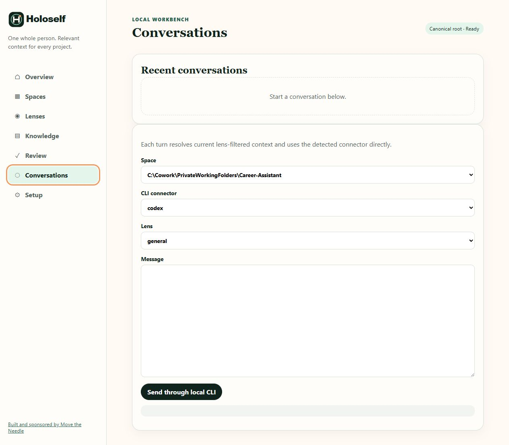

# Conversations

Conversations runs a context-aware turn through a detected local CLI. It is a convenience over the local connector and project link, not a hosted Holoself chat service.

## Before sending

You need:

- at least one registered and healthy Space;
- an available CLI connector with conversation capability;
- a lens appropriate to the request.

Select the Space, connector, and lens, then enter the message. Each turn resolves current bounded context using the message as the task, invokes the CLI directly from the project directory, and appends the result to a project-owned transcript under `.holoself/conversations/`.

Recent conversation context is bounded before reuse. The prompt also reminds the connector that durable self changes require a proposal and separate approval.

## Interpret failures

- **No conversation-capable CLI connector detected**: inspect [Setup](setup.md); Workbench does not install or authenticate the tool.
- A Space is degraded: repair the link and preview context before retrying.
- Harness/provider failure: the Markdown root is unchanged; diagnose the local CLI independently.
- An unexpected answer: verify the selected Space and Lens, then use **Preview context** to inspect what was eligible.

Conversation transcripts are project artifacts. They do not become canonical knowledge unless a proposal is reviewed and approved.

[Next: Setup](setup.md) · [Back to the Workbench tour](index.md)
