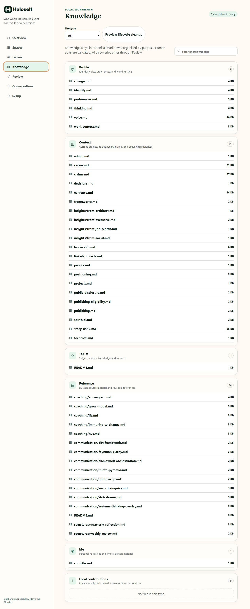
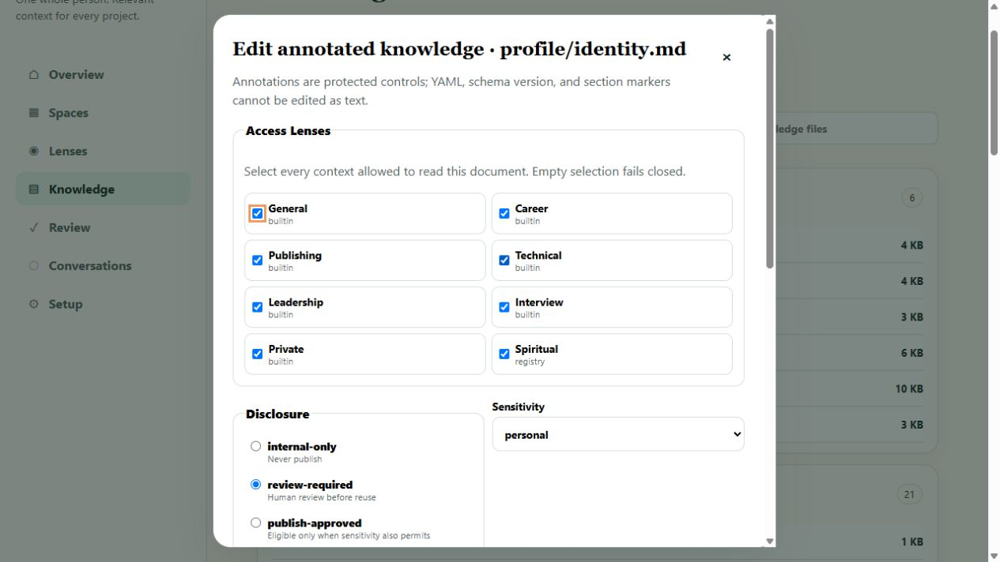

# Knowledge

Knowledge is the human-facing view of canonical Markdown. Files stay grouped by ownership and purpose; Workbench does not replace the files with a database.

## Browse and filter

The groups map directly to canonical root folders:

- **Profile** — identity, voice, preferences, and working style.
- **Context** — current projects, relationships, claims, and circumstances.
- **Topics** — subject-specific knowledge.
- **Reference** — durable source material and reusable methods.
- **Me** — personal narratives and whole-person material.
- **Local contributions** — private local frameworks and extensions.

Use the filename filter to narrow the visible rows. Use **Lifecycle** to show all, current, historical, or superseded documents.

## Edit an annotated document

Select a file to open the guarded editor.

1. Review **Access Lenses**. An empty selection fails closed.
2. Set **Disclosure** independently from lens access: `internal-only`, `review-required`, or `publish-approved`.
3. Choose **Sensitivity** and **Document role**; optionally record confidence.
4. Treat **Visibility** and **Public-safe override** as legacy compatibility fields. Derived policy is preferred.
5. Edit only the exposed content segments. YAML, schema version, and `os-section` markers remain protected.
6. Choose **Review structured changes**, inspect the metadata and segment count, then **Validate and save**.

The backend hash-guards the write, validates the entire root, and rolls back on validation failure. A stale editor is rejected instead of overwriting a newer change.

## Preview lifecycle cleanup

**Preview lifecycle cleanup** is read-only. It separates safe automatic operations from review-only findings and binds the plan to a digest. Applying a non-empty plan requires typing that exact digest; changed inputs invalidate the preview. Review-only items are never silently deleted.

AI-discovered knowledge should enter through a project proposal and [Review](review.md), not through an unreviewed canonical edit.

[Next: Review](review.md) · [Back to the Workbench tour](index.md)
