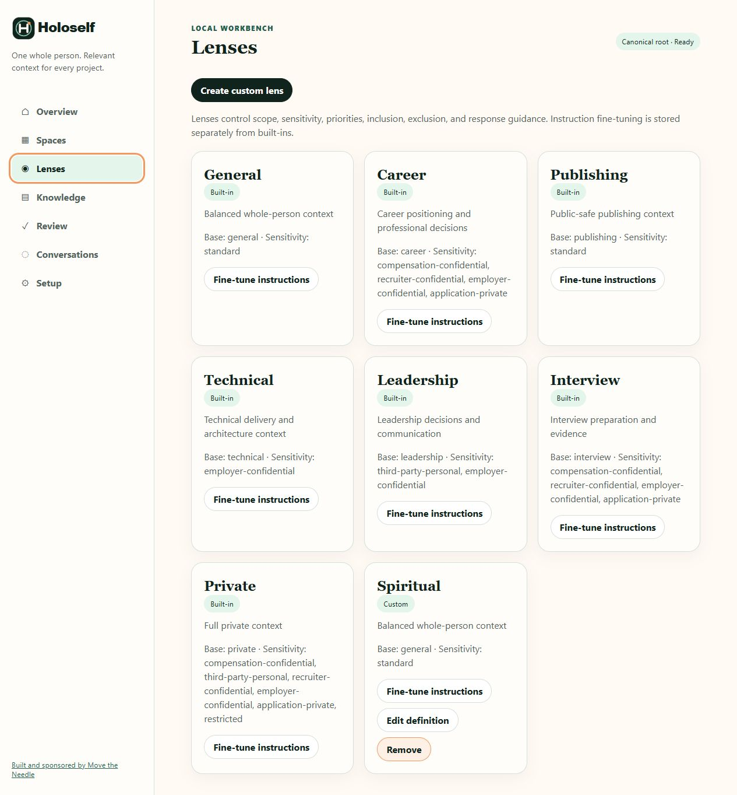
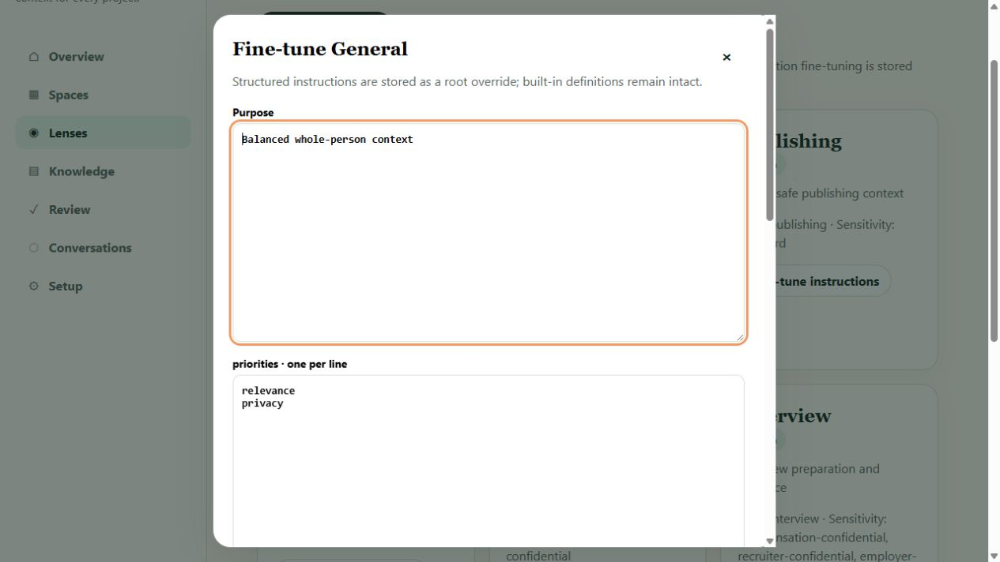

# Lenses

A Lens controls which knowledge and sensitivity categories are eligible for a task and adds response guidance. Readability is not publication approval: disclosure metadata still controls whether content may be reused or published.

## Built-in and custom lenses

Built-in lenses supply stable defaults such as `general`, `career`, `publishing`, `technical`, `leadership`, `interview`, and `private`. Their cards show purpose, base lens, and sensitivity access.

Custom lenses extend a built-in base. They can narrow or deliberately extend sensitivity access for a recurring domain. Existing project links may depend on a custom lens, so inspect those links before removing it.

## Fine-tune response instructions

**Fine-tune instructions** stores a root-owned override while leaving the built-in definition intact.

The structured fields are:

- **Purpose** — the job this lens should do.
- **Priorities** — decision order or qualities to optimize.
- **Include** — context themes to prefer.
- **Exclude** — context themes to avoid.
- **Response guidance** — how answers should be framed.

Use one item per line. **Validate instruction override** performs validation and concurrency checks before saving. If another process changed the registry, Workbench reloads instead of overwriting it.

## Create or edit a custom lens

1. Choose **Create custom lens**.
2. Enter a stable lowercase ID, a human title, and a built-in base lens.
3. Add only the sensitivity categories the lens genuinely requires.
4. Validate and save, then verify a linked Space with **Preview context**.

Do not use a custom lens to bypass disclosure policy. In particular, `publishing` selects public-safe context but does not turn review-required or confidential content into publish-approved content.

[Next: Knowledge](knowledge.md) · [Back to the Workbench tour](index.md)
