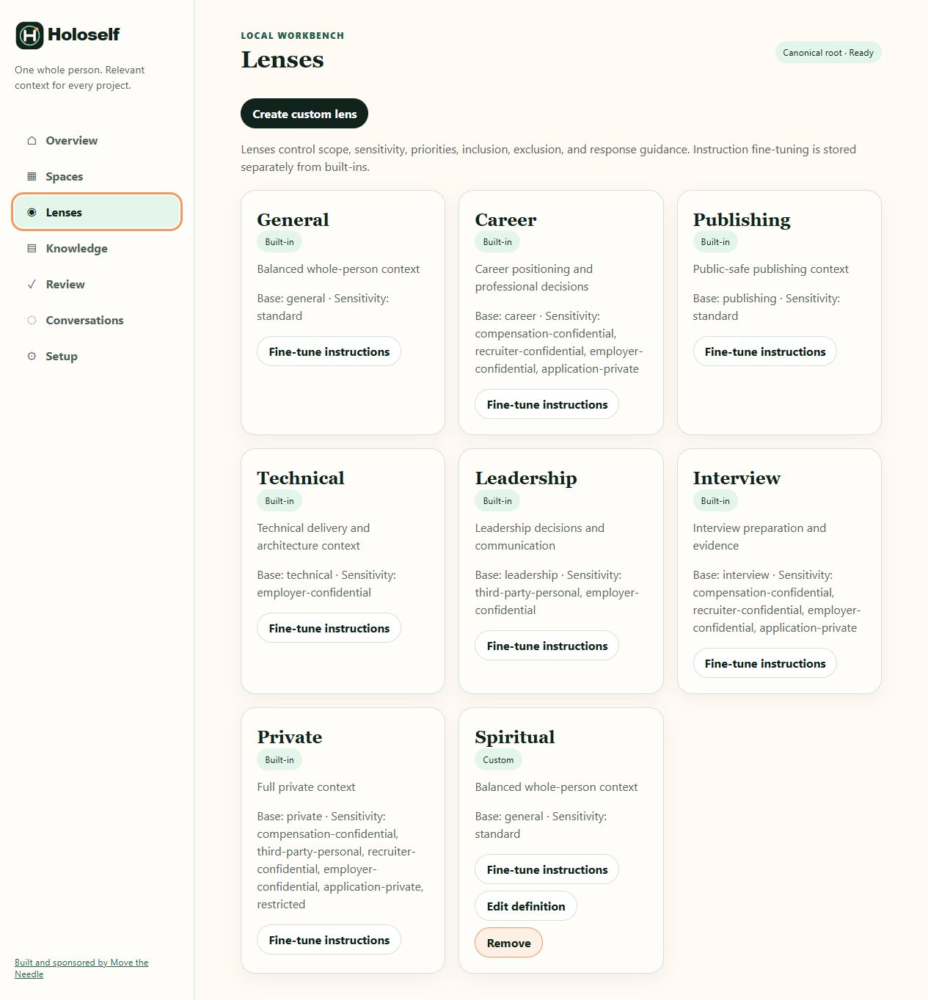

# Lenses

All perspectives use self-side definitions with the same controls.

Choose **Create lens** to supply an ID, title and sensitivity categories. IDs match filenames and use lowercase kebab-case. Every definition has **Edit definition** and **Fine-tune instructions**. Instructions are stored inside the definition; there is no base-lens inheritance.

In **Spaces**, **Edit binding** selects a default and secondary lenses. Removing a binding prunes the project from the catalog and blocks linked retrieval until it is bound again. A bound definition cannot be removed. `private` stays exclusive to the direct owner and cannot be removed.

Edits require the current registry hash. Stale edits fail without replacing newer data. `public-voice` preserves compensation and unapproved evidence when those documents permit it; external publication remains a separate user action. See [lenses and privacy](../concepts/lenses-and-privacy.md).
