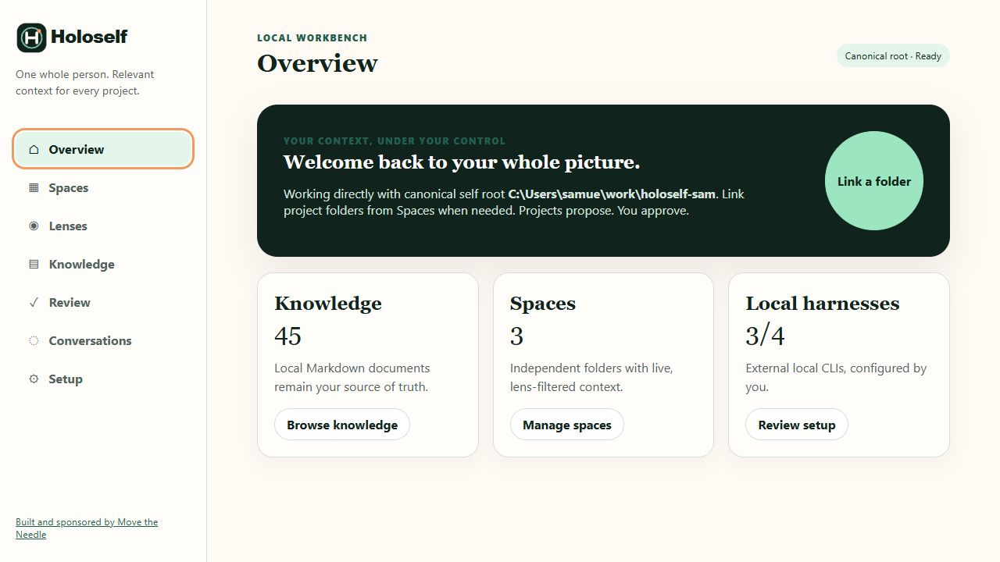

# Overview

Overview answers one question: **is this the self root and launch context I intended to use?** Check that before linking folders, editing knowledge, or starting a conversation.

## What the screen shows

- The readiness badge identifies canonical-root or linked-project mode.
- **Knowledge** counts Markdown documents that Workbench can browse.
- **Spaces** counts project folders currently registered with this root.
- **Local harnesses** shows detected conversation-capable CLIs out of the built-in set.

The counts are orientation signals, not validation results. A root can be ready while an individual Space is degraded.

## Choose the next action

- Use **Browse knowledge** when the root is correct and you need to inspect or edit a document.
- Use **Manage spaces** or **Link a folder** when a project needs bounded context.
- Use **Review setup** when a CLI or application is missing from Conversations or **Open here**.

If the canonical path is unexpected, stop the server and relaunch with the intended `--root`. Do not compensate by linking the wrong root to a project.

[Next: Spaces](spaces.md) · [Back to the Workbench tour](index.md)
