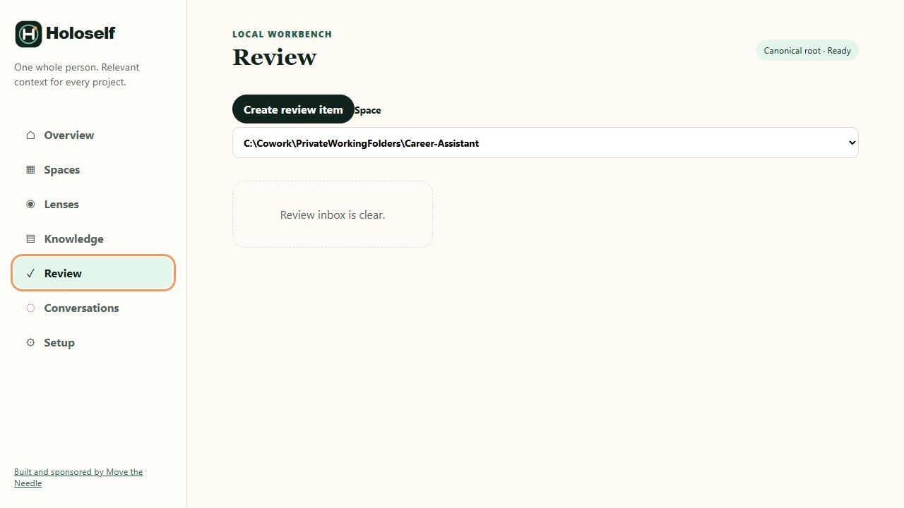

# Review

Review is the human approval boundary between project-owned evidence and reusable canonical self knowledge. A model or connector can create a pending proposal, but it cannot approve its own durable change.

The real inbox in the screenshot is clear. That is a valid state: it means the selected Space has no pending or invalid proposal items, not that proposal review is disabled.

## Read the inbox

Choose a Space first. Pending cards show the proposal title or claim, number of structured changes, and target files. Audit findings that cannot be adopted safely appear as **Needs adoption or repair** with a diagnostic code and suggested action.

## Create a pending item manually

**Create review item** asks for:

- the proposed claim;
- a project-owned source file containing evidence;
- the canonical target, defaulting to `context/claims.md`.

Creating the item writes only a pending proposal inside the selected project's `.holoself/proposals/`. It does not update canonical self.

## Make a decision

1. Open **Review decision**.
2. Verify the target document, source evidence, exact knowledge to add, and affected files.
3. Choose one action:
   - **Approve exact change** applies only the previewed hash-bound change;
   - **Defer** keeps the item pending for later consideration;
   - **Reject** records that the proposal should not be adopted;
   - **Supersede** records that a newer proposal or evidence replaces it.
4. Confirm the decision and re-check the inbox.

If the preview changed after you opened it, approval fails as stale. Re-open the proposal and review the new exact change; never bypass the hash check.

[Next: Conversations](conversations.md) · [Back to the Workbench tour](index.md)
