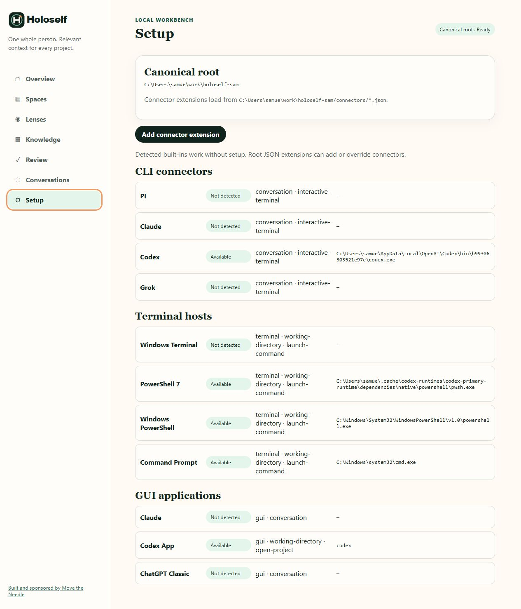

# Setup and connectors

Setup shows the canonical root and the local tools Workbench can safely invoke. Built-ins are detected automatically; optional extensions are stored under `<root>/connectors/*.json`.

## Connector groups

- **CLI connectors** can run a bounded conversation and, when supported, open an interactive terminal.
- **Terminal hosts** launch a command with a fixed working directory and structured arguments.
- **GUI applications** open a project or provide a supported conversation entry point.

`Available` means the executable or application identifier was detected on this machine. `Not detected` is informational; Holoself does not install, authenticate, or update the external tool.

## Add a root-owned extension

Use **Add connector extension** only for an installation that the built-ins cannot describe. Supply a kind, stable ID, name, executable or Windows AppID, fixed prompt/interactive arguments, and explicit capabilities.

The saved JSON is validated and contained under the canonical root. Launch plans use a registered Space allowlist, structured arguments, and `shell: false`; there is no generic command endpoint. Do not put credentials in connector JSON or arguments.

## Diagnose a missing connector

1. Confirm the tool is actually installed and runnable under the same user identity as Workbench.
2. Check whether its detected kind and capabilities match the operation you want.
3. Prefer the built-in definition when it works.
4. Add an extension only for a custom executable or application identifier.
5. Return to [Spaces](spaces.md) for **Open here** or [Conversations](conversations.md) for a context-aware turn.

Changing Setup does not grant a connector broader knowledge access. Space links, lenses, disclosure, sensitivity, and proposal review still enforce the context boundary.

[Back to the Workbench tour](index.md) · [Architecture and trust boundary](../web-gui.md#architecture-and-trust-boundary)
