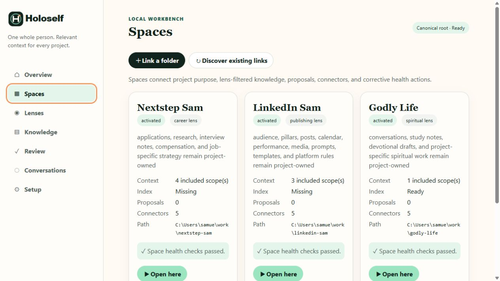

# Spaces

A Space is an independent project folder linked to canonical self. The project keeps its instructions, indexes, proposals, reports, and conversations; the self root keeps approved reusable knowledge.

The screenshot shows three real projects linked from their current folders under `C:\Users\samue\work`. Each link is activated and passes its Space health checks. A missing index is reported separately because indexes are rebuildable project artifacts, not a broken link.

## Link or discover a project

**Link a folder** browses one local directory level at a time, accepts an absolute path, and asks for a lens. Saving runs the same validated link workflow as `holoself link add`, creates or updates project-owned `.holoself` metadata, activates supported agent instructions, and registers the Space in the root catalog.

Choose the least-broad lens that fits the project's purpose. Linking does not copy canonical self documents into the project.

**Discover existing links** reconciles links already known to the canonical root. Use it after moving between the CLI and Workbench or when a valid linked folder is not listed.

## Read a Space card

| Field | Meaning |
|---|---|
| State and lens | Activation/link health and the default context policy |
| Context | Number of configured project include scopes, not the number of selected documents |
| Index | Whether the project-owned rebuildable index exists |
| Proposals | Pending project-owned review items |
| Connectors | Detected local launch choices |
| Path | The independent project folder |

`Space health checks passed` means the link can be resolved under the current policy. `Degraded` lists concrete findings and, when safe, offers fixed actions such as activate, repair, relink, or rebuild index.

## Use the actions safely

- **Preview context** resolves a small manifest through the current link and lens. Check selected sources, restrictions, hashes, and truncation before relying on it.
- **Health details** runs link diagnostics and shows the command result.
- **Review proposals** moves to the inbox for that project's reusable-knowledge proposals.
- **Open here** offers detected CLI, GUI, and terminal launch plans rooted in the Space directory.
- **Remove link** removes managed activation and `link.yaml` after confirmation. Project artifacts outside managed link metadata remain untouched; indexes, reports, and proposals are preserved for review by the underlying link contract.

## Recover a degraded Space

1. Read the exact finding. Do not guess from the badge alone.
2. Use **Health details** or run `holoself link doctor --project <path>`.
3. Prefer the specific corrective action offered on the card.
4. Re-open the card and use **Preview context** before resuming work.

If the project folder was intentionally retired, use **Remove link** only after confirming the exact Space. If it moved, relink the intended folder; do not create a second canonical self root to make the warning disappear.

[Next: Lenses](lenses.md) · [Back to the Workbench tour](index.md)
