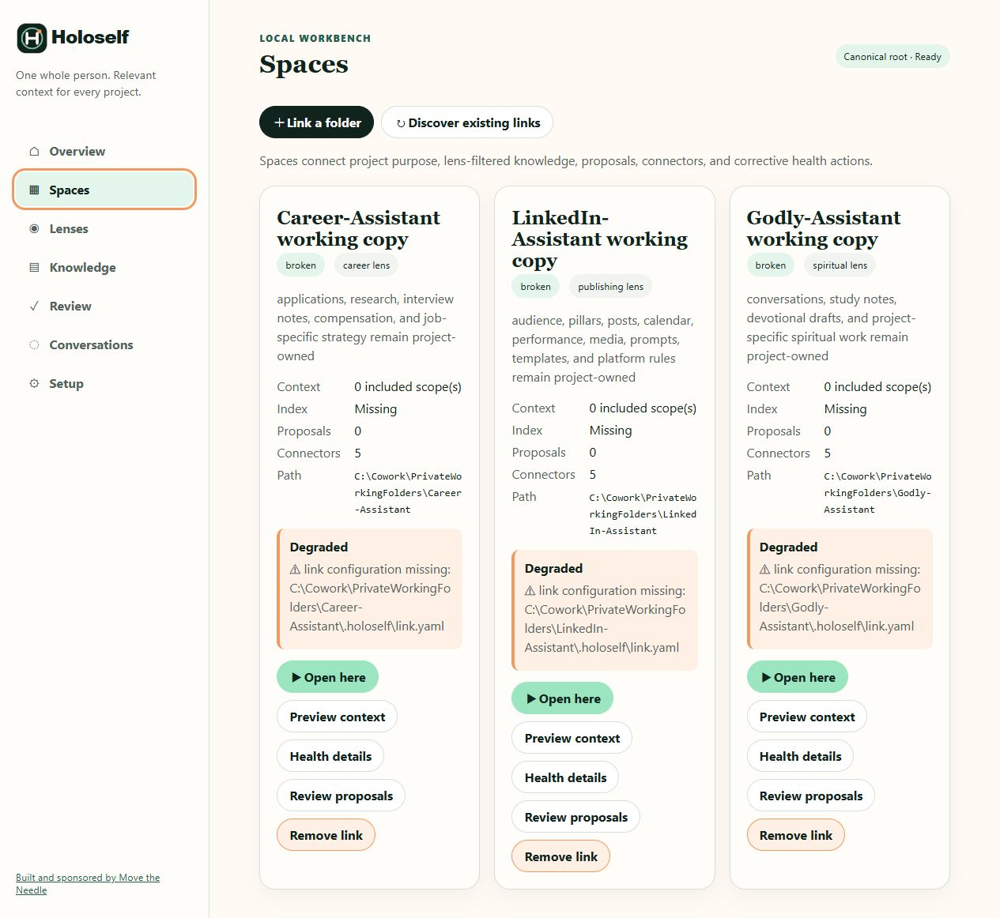

# Spaces

A Space is an independent project folder linked to canonical self. The project keeps its instructions, indexes, proposals, reports, and conversations; the self root keeps approved reusable knowledge.

The screenshot shows three real projects linked from their current folders under `C:\Users\samue\work`. Each link is activated and passes its Space health checks. A missing index is reported separately because indexes are rebuildable project artifacts, not a broken link.

## Link or discover a project

**Link a folder** browses one local directory level at a time, accepts an absolute path, and asks for a lens. Saving runs the same validated link workflow as `holoself link add`, creates or updates project-owned `.holoself` metadata, activates supported agent instructions, and registers the Space in the root catalog.

Choose the least-broad lens that fits the project's purpose. Linking does not copy canonical self documents into the project.

**Discover existing links** reconciles and prunes the catalog from `<root>/lenses/bindings.json`. Use it after moving between the CLI and Workbench or when a valid linked folder is not listed.

## Read a Space card

| Field | Meaning |
|---|---|
| State and lens | Activation/link health and the default context policy |
| Context | Self-only retrieval; domain documents remain owned by the project |
| Index | Whether the project-owned rebuildable index exists |
| Proposals | Pending project-owned review items |
| Connectors | Detected local launch choices |
| Path | The independent project folder |

`Space health checks passed` means the link can be resolved under the current policy. `Degraded` lists concrete findings and, when safe, offers fixed actions such as activate, repair, relink, or rebuild index.

**Repair** opens a review dialog first. It shows the adapters to restore and where that list came from (`recorded`, `detected`), any lens-binding migration, and every file to write. Nothing changes until you choose **Apply repair plan**. If the project changed after the preview, apply is refused (`PLAN_CHANGED`) and you review the new plan.

## Use the actions safely

- **Preview context** resolves a small manifest through the current link and lens. Check selected sources, restrictions, hashes, and truncation before relying on it.
- **Health details** runs link diagnostics and shows the command result.
- **Review proposals** moves to the inbox for that project's reusable-knowledge proposals.
- **Open here** offers detected CLI, GUI, and terminal launch plans rooted in the Space directory.
- **Edit binding** edits the default and secondary lens choices in the self root. Removing a binding prunes its Space from the catalog and makes context fail closed until rebound.
- **Remove link** removes managed activation and `link.yaml` after confirmation. Project artifacts outside managed link metadata remain untouched; indexes, reports, and proposals are preserved for review by the underlying link contract.

## Recover a degraded Space

1. Read the exact finding. Do not guess from the badge alone.
2. Use **Health details** or run `holoself link doctor --project <path>`.
3. Prefer the specific corrective action offered on the card.
4. Re-open the card and use **Preview context** before resuming work.

If the project folder was intentionally retired, use **Remove link** only after confirming the exact Space. If it moved, relink the intended folder; do not create a second canonical self root to make the warning disappear.

[Next: Lenses](lenses.md) · [Back to the Workbench tour](index.md)

## Review space changes

Activate, deactivate, relink and setup first show the complete file and directory plan. Review the paths, then choose **Apply**. Preview does not reconcile the catalog, acquire locks, create temporary files, or write project/self files. Cancel leaves the filesystem unchanged.

The API uses two POSTs to `/api/spaces/:id/activate`, `/deactivate`, `/relink` or `/setup`: `{}` returns `data.preview.plan` and `data.preview.plan_hash`; `{ "apply": true, "plan_hash": "<reviewed hash>" }` applies that plan. A missing hash or changed file content, link, lens binding, runtime or adapter discovery returns HTTP 409 with `PLAN_CHANGED`; preview again before applying. Hashes are specific to the action, project and canonical root.

Relink and setup preserve existing README, proposals, reports, project filters, secondary lenses and recorded activation choices. Their plans include canonical-root binding and link-registry writes, plus the temporary registry lock. Legacy setup verifies the exact junction target and all activation paths before replacing the junction; a recoverable failure restores the prior files and junction. Recovery never recursively removes a metadata directory: unexpected contents produce an explicit recovery error.

Workbench space writes are serialized in this process and preconditions are rechecked immediately before synchronous file changes. The link-registry lock coordinates cooperating registry writers. These checks do not provide an operating-system transaction against unrelated external processes changing files concurrently.
